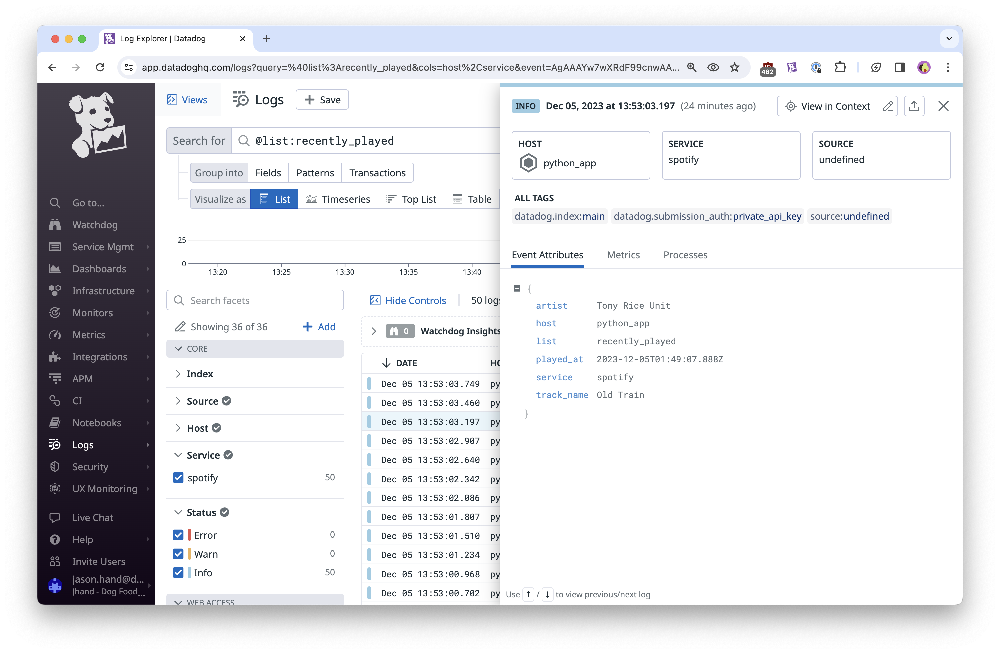

# Spotify Dogged
Demo on sending Spotify API data to Datadog to visualize in Dashboards

After cloning or copying this code, you'll need to change a few things before it will work.

You will need the following:

- Spotify Client ID
- Spotify Client Secret
- Datadog API Key

Create a `.env` file in the root of the project and add the 3 secrets from above, similar to [the sample provided](sample_env.env).

Once your own credentials have been added, run the python script from the directory it is saved in by running the following command from the terminal: 

`python spotify.py`

This will display a menu in the terminal like below.

There are a couple of menu options to retrieve Top Tracks, Top Artists. Each option will then give you another menu to retrieve the short, medium, and long-term records. Then you be given an option to send the data to Datadog. 

For the Recently Played Tracks menu option, there is no short, medium, or long-term sub-options so the 2nd question asks if you want to send to Datadog.

Next steps: 

- Turn this into a serverless function to run on a timer and does not include menu options
- Create new fields that are calculations from fields queried from Spotify.

